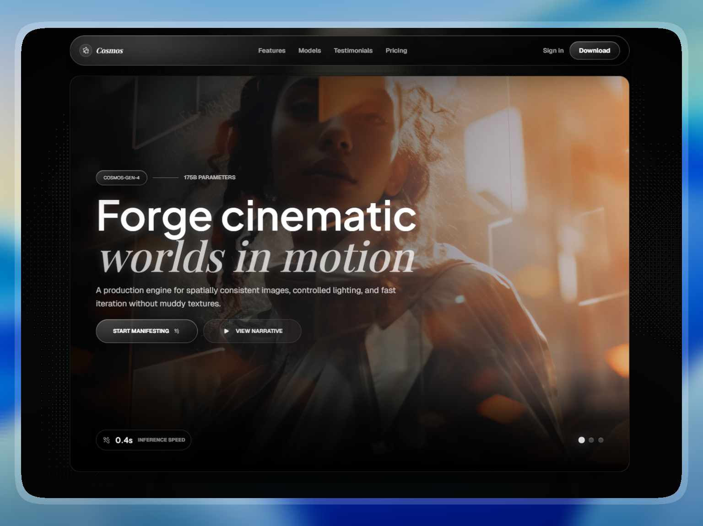

# 🚀 Cosmos AI Landing Page

> **Day 2/30 of the "Building 1 AI-Generated Landing Page Every Day" Challenge**



## 🚀 About

Conceptual landing page for **Cosmos AI**, a **State-of-the-art AI Image Generation Platform**, developed with **Next.js 16** and **Tailwind CSS 4**. This project is the second realization of an ambitious challenge: creating **1 complete and functional mockup per day using AI**.

Cosmos AI, powered by the **cosmos-gen-4** model, is designed to manifest the impossible. The goal is to convey **unprecedented precision**, **neural depth**, **cinematic fidelity**, and **artistic soul** through a premium, atmospheric aesthetic.

## 🎨 Design & Aesthetic Decisions (The "Why")

For this second day, the chosen theme revolves around **Neural Synthesis, Latent Space, and Cinematic Reality**.

- **Atmospheric "Deep Space" Mode:** The interface relies on a near-black background (`#030303`) paired with custom shaders and pixel-blast effects. It evokes the feeling of peering into the latent space of a supercomputer.
- **Vibrant Gradients & Shaders:** `LightRays`, `PixelBlast`, and optional shader backgrounds add depth, movement, and a cinematic layer to the page.
- **Glassmorphism & Micro-animations:** Subtle blurs, animated sliders, glowing borders, scan lines, and smooth transitions create a multi-layered UI that feels premium and "studio grade."
- **Typography:** Leveraging _Plus Jakarta Sans_, _Geist_, and _Playfair Display_ to balance technical precision with modern elegance.

## 🧩 Key Sections

- **🌟 Neural Hero:** A bold introduction to the "cosmos-gen-4" engine, featuring rotating cinematic visuals, high-fidelity CTAs, and sub-second inference stats.
- **🧠 Model Showcase:** An in-depth bento section for the "Neural Architecture," showcasing latent core processing, shot memory, color scope, and 175B parameter statistics.
- **✍️ Prompt Engine:** A specialized section for "Semantic Synthesis," highlighting token parsing, prompt weights, preview locking, and refinement states.
- **🎨 Artistry Suite:** A 12-column bento feature grid showcasing identity lock, lighting grammar, creative workflow, live generation, and production-ready validation.
- **💬 Creative Voices:** Rotating testimonial cards from industry leaders (VFX Directors, Digital Artists) highlighting the platform's professional impact.
- **💸 Pricing Bento:** Interactive plan cards paired with an animated studio-capacity preview for render volume, delivery lanes, and team workflows.

## 🛠️ Tech Stack

This mockup was built with cutting-edge technologies:

- **[Next.js 16](https://nextjs.org/)** (App Router)
- **[React 19](https://react.dev/)**
- **[Tailwind CSS v4](https://tailwindcss.com/)** for ultra-fast utility styling.
- **[Motion](https://motion.dev/)** for sliders, reveal transitions, and interactive card states.
- **[Three.js](https://threejs.org/)**, **[OGL](https://github.com/oframe/ogl)**, and **Postprocessing** for WebGL-powered visual effects.
- **[@paper-design/shaders-react](https://paper.design/)** for advanced background grain gradients.
- **[Iconify](https://iconify.design/)** for high-performance, customizable iconography.
- **Google Fonts** (Plus Jakarta Sans, Geist & Playfair Display) for premium typography.

## 🚀 Quick Start

```bash
# Install dependencies
npm install

# Run development server
npm run dev
```

Open [http://localhost:3000](http://localhost:3000) in your browser to see the result.

## 🌌 Let's meet in space (or on Earth) 🚀

I'm always happy to discuss new projects, collaborations, or simply exchange creative ideas. Here's how to contact me:

- **📧 Email**: [hello@adrielzimbril.com](mailto:hello@adrielzimbril.com)
- **🌐 Website**: [https://www.adrielzimbril.com](https://www.adrielzimbril.com)
- **🐦 Twitter**: [https://twitter.com/adrielzimbril](https://twitter.com/adrielzimbril)
- **💼 LinkedIn**: [https://www.linkedin.com/in/adrielzimbrilcode](https://www.linkedin.com/in/adrielzimbrilcode)
- **🐼 GitHub**: [https://github.com/adrielzimbril](https://github.com/adrielzimbril)

### 🐼 Fun Facts

- 🚀 Passionate about AI and Generative Art
- 🐼 Love pandas (and animals in general!)
- 🎨 Creative at heart, whether in design or code
- ☕ Addicted to coffee and complex technical challenges

## 🌟 Join the Adventure

If you like this project, feel free to:

- ⭐ Star the project
- 🐞 Report bugs
- ✨ Suggest improvements
- 🚀 Share with other enthusiasts

## 💖 Support the Project

If you find this project useful and would like to support its development, you can do so through these platforms:

[](https://go.adrielzimbril.com/gs)

## 🌐 Hosting

This project is 100% hosted on modern cloud infrastructure:

[](https://vercel.com)

## 📄 License

This project is under the MIT license. Feel free to use it as a base for your own portfolio or project.

---

**Developed with ❤️ by Adriel Zimbril**  
_Product Designer & Fullstack Developer_  
🚀 Digital Universe Explorer | 🐼 Panda Friend | 🎨 Passionate Creator
